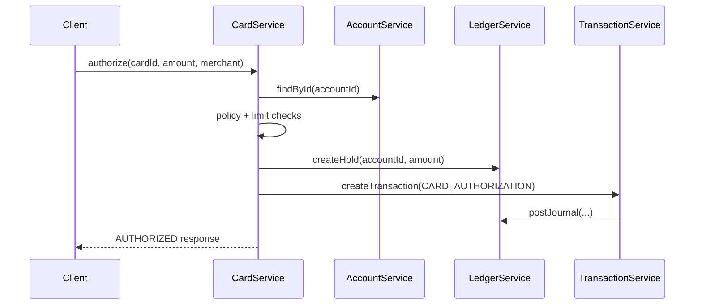
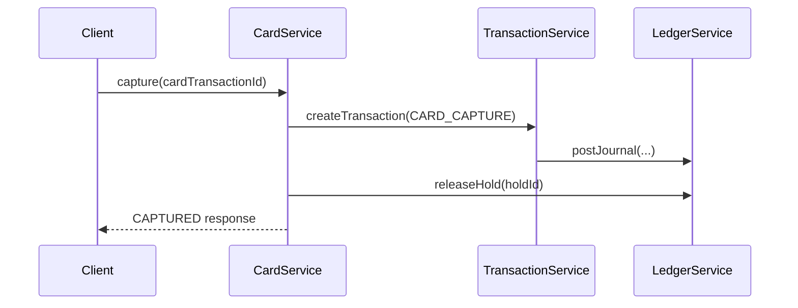
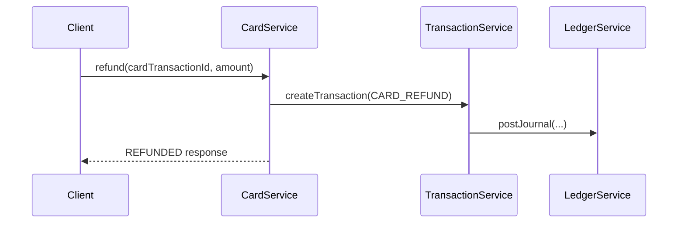

# Card Sequence Diagrams

## Authorization

```mermaid
sequenceDiagram
  participant Client
  participant Cards as CardService
  participant Accounts as AccountService
  participant Ledger as LedgerService
  participant Txn as TransactionService

  Client->>Cards: authorize(cardId, amount, merchant)
  Cards->>Accounts: findById(accountId)
  Cards->>Cards: policy + limit checks
  Cards->>Ledger: createHold(accountId, amount)
  Cards->>Txn: createTransaction(CARD_AUTHORIZATION)
  Txn->>Ledger: postJournal(...)
  Cards-->>Client: AUTHORIZED response
```

## Capture/Settlement

```mermaid
sequenceDiagram
  participant Client
  participant Cards as CardService
  participant Txn as TransactionService
  participant Ledger as LedgerService

  Client->>Cards: capture(cardTransactionId)
  Cards->>Txn: createTransaction(CARD_CAPTURE)
  Txn->>Ledger: postJournal(...)
  Cards->>Ledger: releaseHold(holdId)
  Cards-->>Client: CAPTURED response
```

## Refund

```mermaid
sequenceDiagram
  participant Client
  participant Cards as CardService
  participant Txn as TransactionService
  participant Ledger as LedgerService

  Client->>Cards: refund(cardTransactionId, amount)
  Cards->>Txn: createTransaction(CARD_REFUND)
  Txn->>Ledger: postJournal(...)
  Cards-->>Client: REFUNDED response
```
