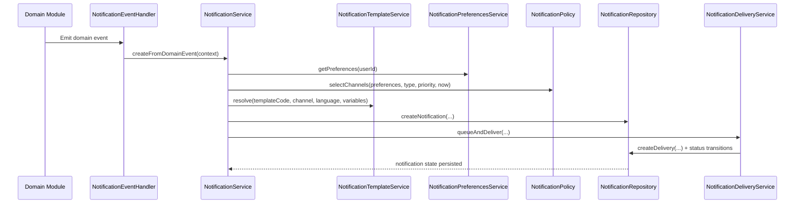
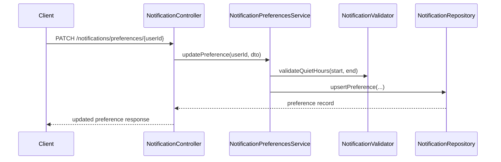
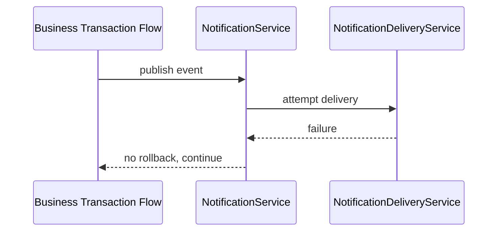

# Notification Sequence Diagrams

## Domain Event To Delivery

```mermaid
sequenceDiagram
    participant Domain as Domain Module
    participant Handler as NotificationEventHandler
    participant Service as NotificationService
    participant Template as NotificationTemplateService
    participant Prefs as NotificationPreferencesService
    participant Policy as NotificationPolicy
    participant Repo as NotificationRepository
    participant Delivery as NotificationDeliveryService

    Domain->>Handler: Emit domain event
    Handler->>Service: createFromDomainEvent(context)
    Service->>Prefs: getPreferences(userId)
    Service->>Policy: selectChannels(preferences, type, priority, now)
    Service->>Template: resolve(templateCode, channel, language, variables)
    Service->>Repo: createNotification(...)
    Service->>Delivery: queueAndDeliver(...)
    Delivery->>Repo: createDelivery(...) + status transitions
    Repo-->>Service: notification state persisted
```

## Preference Update

```mermaid
sequenceDiagram
    participant Client
    participant Controller as NotificationController
    participant Prefs as NotificationPreferencesService
    participant Validator as NotificationValidator
    participant Repo as NotificationRepository

    Client->>Controller: PATCH /notifications/preferences/{userId}
    Controller->>Prefs: updatePreference(userId, dto)
    Prefs->>Validator: validateQuietHours(start, end)
    Prefs->>Repo: upsertPreference(...)
    Repo-->>Controller: preference record
    Controller-->>Client: updated preference response
```

## Delivery Failure Isolation

```mermaid
sequenceDiagram
    participant Business as Business Transaction Flow
    participant Notifications as NotificationService
    participant Delivery as NotificationDeliveryService

    Business->>Notifications: publish event
    Notifications->>Delivery: attempt delivery
    Delivery-->>Notifications: failure
    Notifications-->>Business: no rollback, continue
```
